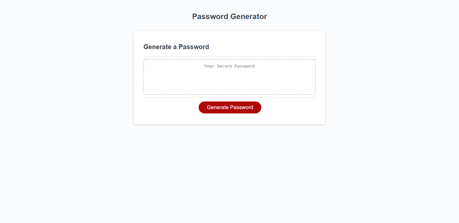
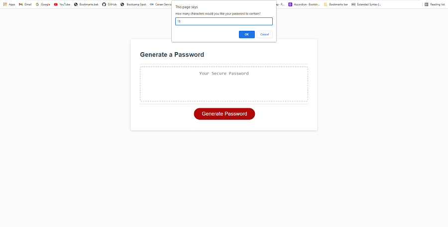
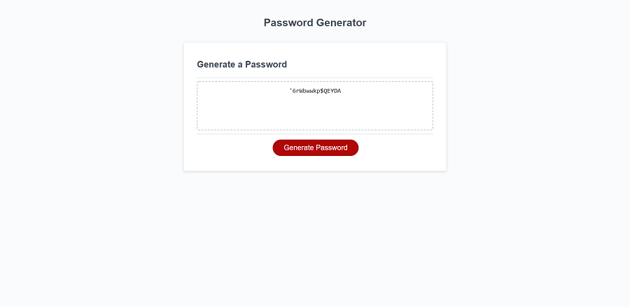

# Password-Generator
This application was built to assist with generating a strong password with random numbers, letters, and characters. After, you have opened the application simply click on the generate password button. You will be prompted to answer some questions in the modal that appears at the top of the screen. You then have the choice to choose a number between 1 and 128 for password length, capital letters, numeric characters, lowercase letters, and special characters. Once you have fulfilled all of these questions to your liking a random password will be generated for you.

# Table of Contents 
- [Installation](#installation)  
- [Usage](#usage)
- [Project Links](#project-links)
- [Credits](#credits)
- [License](#license)

## Installation
To install this application simply clone this repository. If you would like to view the application locally I would recommend downloading an extension that allows you to view code in your default browser. If you are using Visual Studio Code I recommend the [open in browser] extension by "TechER".

## Usage 
After you have cloned the repository and downloaded an extension you will be able to open the application locally.

### Links 

#### Project Links:
- [Deployment from GitHub Pages](https://cameronheadlee.github.io/Password-Generator/)  
- [GitHub Repository](https://github.com/CameronHeadlee/Password-Generator)

#### Screenshots of application:
- Image of application when initially opened.    
      
- Image of application during process of generating password.  
  
- Image of the randomly generated password.    

## Credits
This application was built using:
- HTML5  
- JavaScript  
- CSS3  

## License
This application is licensed under the MIT License  

## Questions
If you have any questions or suggestions on improvements please email me below:
- [Email](mailto:camhcodes11@gmail.com)

Checkout what else I have been working on!  
- [GitHub](https://github.com/CameronHeadlee?tab=repositories)
